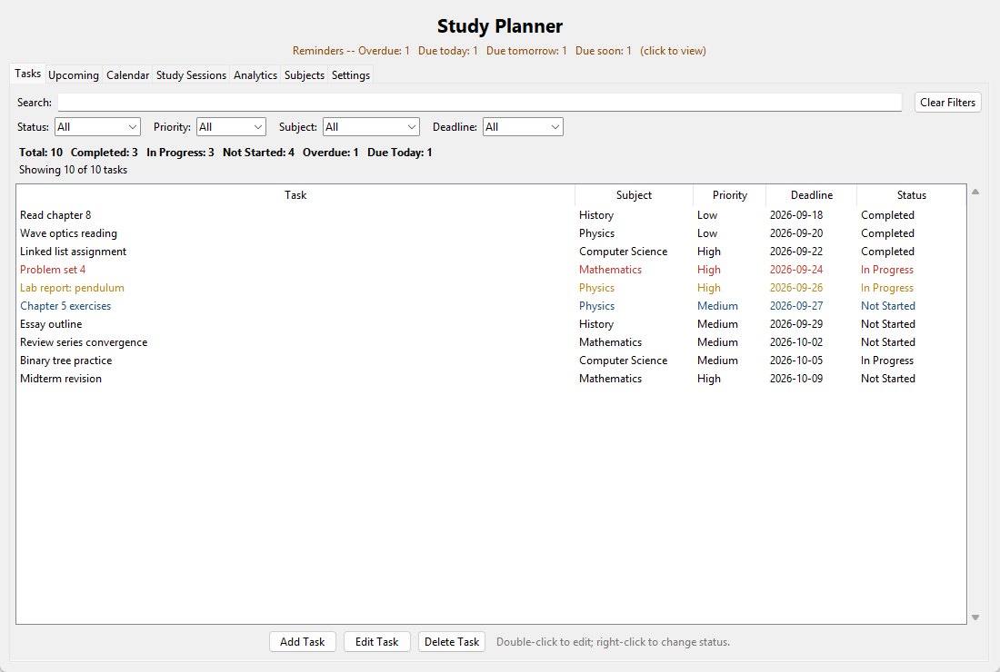
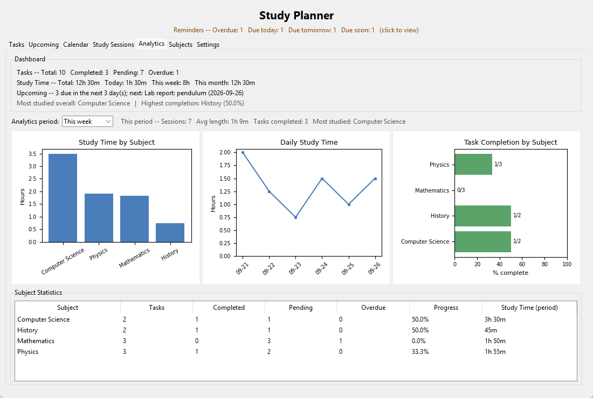
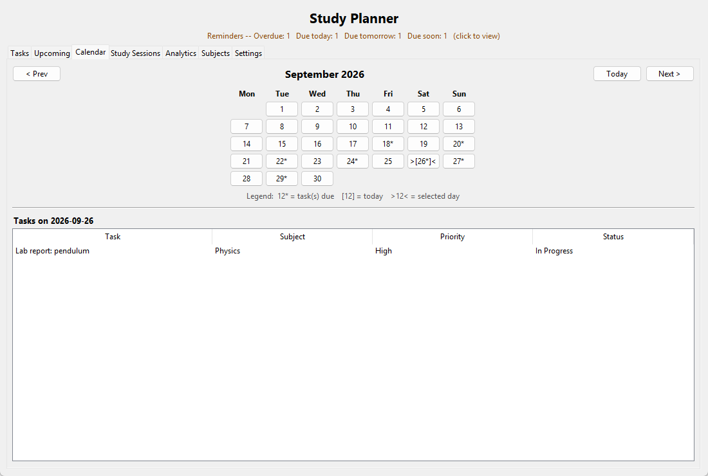
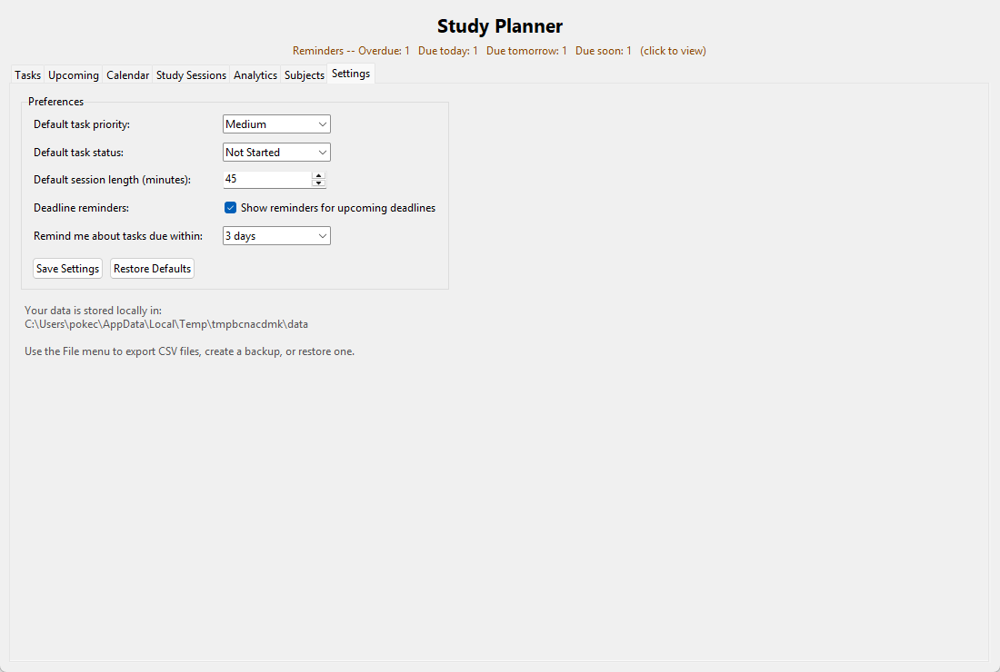

# Study Planner

## Overview

Study Planner is a desktop application for students to organize study
tasks by subject, keep track of deadlines, log study time, and see how
their work is progressing. It runs entirely on your own computer: data is
stored in a local JSON file, and nothing is ever sent over the network.

## Features

- **Subject management** – add, edit, and delete subjects (a subject that
  still has tasks or study sessions can't be deleted, so nothing is lost
  by accident).
- **Task management** – add, edit, delete, and quickly change status
  (right-click a task) or edit it (double-click).
- **Deadlines and priorities** – every task has a deadline (`YYYY-MM-DD`,
  validated), a priority (`Low` / `Medium` / `High`), and a status
  (`Not Started` / `In Progress` / `Completed`). Completion dates are
  recorded automatically.
- **Search and filtering** – search across task title, description, and
  subject name; filter by status, priority, subject, and deadline
  (Today / This week / Overdue / Upcoming); sort by clicking a column
  header. **Clear Filters** returns to the default view.
- **Deadline awareness** – overdue, due-today, and due-tomorrow tasks are
  color-highlighted. The **Upcoming** tab lists overdue tasks and tasks
  due in the next 7 days.
- **Calendar** – month grid showing which days have deadlines; click a day
  to see its tasks.
- **Study sessions** – log study time (date, duration, notes) against a
  subject and, optionally, a specific task. Edit, delete, and filter the
  history by period and subject.
- **Time and progress tracking** – study-time totals (today, this week,
  this month, all time) and per-subject progress (completed / pending /
  overdue tasks, completion %, study time).
- **Analytics** – a dashboard plus three charts and a subject statistics
  table (see [Analytics](#analytics)).
- **Reminders** – a banner under the title always shows how many tasks
  are overdue, due today, due tomorrow, or due soon (click it to open the
  Upcoming tab). At startup, and every 30 minutes while the app is open,
  a popup lists any reminders you haven't been shown yet in this session
  – the same reminder is never shown twice.
- **Settings** – default task priority and status, default study-session
  length, reminders on/off, and the reminder window (1–14 days).
- **Export** – tasks to CSV, study sessions to CSV, and a plain-text
  summary report.
- **Backup and recovery** – create a backup file, and restore from one
  (validated before anything changes, with an automatic safety copy of
  your current data).

## Screenshots

| Tasks | Analytics |
|---|---|
|  |  |

| Calendar | Settings |
|---|---|
|  |  |

The screenshots use the fictional data in `sample_data/sample_planner.json`.

## Tech Stack

- **Python 3.9+** (developed and tested on Python 3.12)
- **Tkinter / ttk** – the GUI (included with Python)
- **JSON** – local data storage (standard library)
- **Matplotlib** – the Analytics charts (the only third-party dependency)

## Project Structure

```
Study-Planner/
├── main.py              # Entry point: loads data + settings, starts the GUI
├── models.py            # Dataclasses: Subject, Task, StudySession; allowed values
├── data_manager.py      # All data rules: CRUD, validation, filtering/sorting,
│                        #   deadline categories, statistics, saving/loading
├── validation.py        # Checks/repairs records read from disk (data file or backup)
├── settings.py          # User preferences with validated defaults
├── reminders.py         # Groups open tasks into overdue/today/tomorrow/soon
├── exporter.py          # CSV export, summary report, backup and restore
├── gui.py               # Main window and the Tasks, Upcoming, Calendar,
│                        #   Study Sessions, Analytics, and Subjects tabs
├── gui_tools.py         # Settings tab, reminder banner/popup, File menu actions
├── tests/               # Unit tests (unittest)
├── sample_data/         # Fictional example data you can restore to try the app
├── docs/screenshots/    # README screenshots
└── requirements.txt
```

The GUI never reads or writes files or computes statistics itself; it
always calls `DataManager` (or the small modules above), so every rule and
every number is defined in one place.

## Installation

Requires Python 3.9 or newer with Tkinter (included in the standard
python.org installers for Windows and macOS; on some Linux distributions
install it separately, e.g. `sudo apt install python3-tk`).

```bash
git clone https://github.com/Dlyzly-ops007/Study-Planner.git
cd Study-Planner
python -m venv .venv
```

Activate the virtual environment:

```bash
# Windows
.venv\Scripts\activate

# macOS / Linux
source .venv/bin/activate
```

Install the dependency:

```bash
pip install -r requirements.txt
```

## Usage

Start the app from the project folder:

```bash
python main.py
```

1. Open the **Subjects** tab and click **Add Subject**.
2. On the **Tasks** tab, click **Add Task**. Use the search box and filters
   to find tasks, click a column header to sort, double-click a task to
   edit it, and right-click to change its status.
3. On the **Study Sessions** tab, click **Log Session** to record study
   time, optionally linked to a task.
4. Check **Upcoming**, **Calendar**, and **Analytics** for deadlines and
   progress.
5. Change defaults and reminder preferences on the **Settings** tab.
6. Use the **File** menu to export data or to create or restore a backup.

To try the app with example data, choose **File → Restore from Backup…**
and select `sample_data/sample_planner.json`. Your current data is saved
to a safety copy first.

## Data Storage

- Planner data is saved to `data/planner.json` inside the project folder.
  The file and folder are created on first run and saved after every
  change.
- Settings are saved separately to `data/settings.json`. If that file is
  missing or invalid, defaults are used.
- Saves are atomic (written to a temporary file, then swapped in), so a
  crash can't leave a half-written data file.
- The `data/` folder is in `.gitignore`, so your personal data is never
  committed.
- **Validation on startup:** every record is checked. Values that can be
  safely repaired are fixed (an unknown priority becomes `Medium`, an
  invalid status becomes `Not Started`, an invalid deadline is cleared so
  you can set it again). Records that can't be used (e.g. no id, a study
  session with a zero or negative duration) are skipped. Tasks that point
  to a missing subject are kept and shown as "(deleted)". If anything was
  changed, the original file is kept as
  `data/planner.json.before_repair_<timestamp>.bak` and you're told what
  was changed.
- **Corrupted file:** if the file isn't valid JSON, it is kept as
  `data/planner.json.corrupted_<timestamp>.bak`, you're told about it, and
  the app starts with an empty planner. You can then restore a backup.

## Export & Backup

All options are in the **File** menu. Each one opens a save/open dialog
and confirms whether it worked. Exports never change the app's own data
file.

| Menu item | Output |
|---|---|
| Export Tasks (CSV) | ID, Title, Subject, Priority, Deadline, Status, Created, Completed, Description |
| Export Study Sessions (CSV) | ID, Date, Subject, Task, Duration (minutes), Notes |
| Export Summary Report (TXT) | Task totals and completion %, overdue count, study time (total, month, week, today), most-studied subject, study time and completion by subject |
| Create Backup | A `.json` copy of all planner data (the same format as `data/planner.json`) |
| Restore from Backup | Replaces all planner data with a backup |

CSV files are UTF-8 with a BOM, so Excel shows non-English text correctly.

**Restoring** works like this:
1. The file is fully validated first. If it isn't a clean Study Planner
   backup (invalid JSON, wrong structure, or any invalid record), it is
   rejected and your current data isn't touched.
2. You see how many subjects, tasks, and sessions it contains and are
   asked to confirm.
3. Your current data is copied to `data/backups/before_restore_<timestamp>.json`,
   and then the backup is loaded.

## Analytics

The **Analytics** tab has:

- **Dashboard** – task totals (total / completed / pending / overdue),
  study time (total / today / this week / this month), upcoming deadlines
  within your reminder window, the most-studied subject, and the subject
  with the highest completion rate.
- **Period selector** (Today / This week / This month / All time) – applies
  to the charts, the subject statistics table, and the productivity line
  (sessions, average session length, tasks completed, most studied).
- **Charts** – *Study Time by Subject* (bar), *Daily Study Time* (line;
  "Today" shows the current week, since one point isn't a useful trend),
  and *Task Completion by Subject* (always shows current completion,
  because it isn't tied to a time period).
- **Subject Statistics** table – tasks, completed, pending, overdue,
  progress %, and study time for the selected period.

Every statistic is calculated from the saved tasks and sessions each time
it's shown. Nothing is stored separately, so the dashboard, charts, tables,
and exported report always agree.

> **"This week" means two things:** the task *Deadline* filter's "This
> week" looks **forward** (the next 7 days), because deadlines are in the
> future. The study-time "This week" period looks **back** to Monday of
> the current week, because logged time is in the past.

## Testing

```bash
python -m unittest discover -s tests -v
```

The 31 unit tests cover task/subject/session CRUD and validation,
search/filter/sort, deadline categories, consistency between the
dashboard and analytics numbers, time periods, save/reload, corrupted
and partially invalid data files, reminders (grouping, window, no
repeats), settings, CSV and report export, and backup/restore (including
rejecting invalid backups).

## Limitations

- Reminders appear only inside the app while it's running. There are no
  operating-system notifications, and nothing runs in the background when
  the app is closed.
- Dates are entered and shown as `YYYY-MM-DD` only (no date picker, and no
  other date formats).
- Study sessions record a duration, not start and end times, and there is
  no built-in timer.
- Single user on a single computer, with no sync. Only one copy of the app
  should be open on the same data at a time.
- Only one language (English), and the default Tk theme (no dark mode).
- Charts need Matplotlib. If it isn't installed, the Analytics tab shows a
  message instead of charts, and everything else still works.

## Future Improvements

These ideas are **not implemented**:

- Recurring tasks and smarter scheduling
- A study timer (start/stop)
- Optional cloud sync or a mobile companion app
- Deeper productivity analysis (streaks, trends over time)

## License

Licensed under the PolyForm Noncommercial License 1.0.0. See
[LICENSE](LICENSE).
